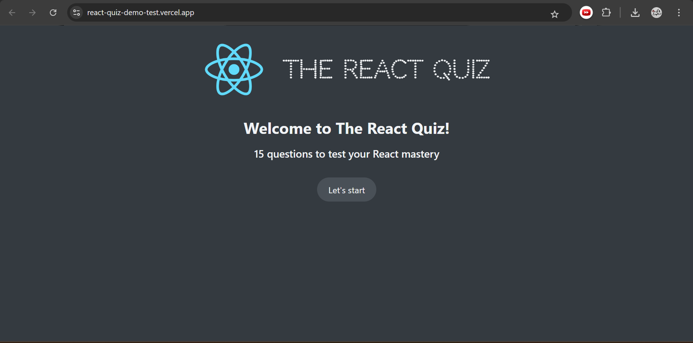
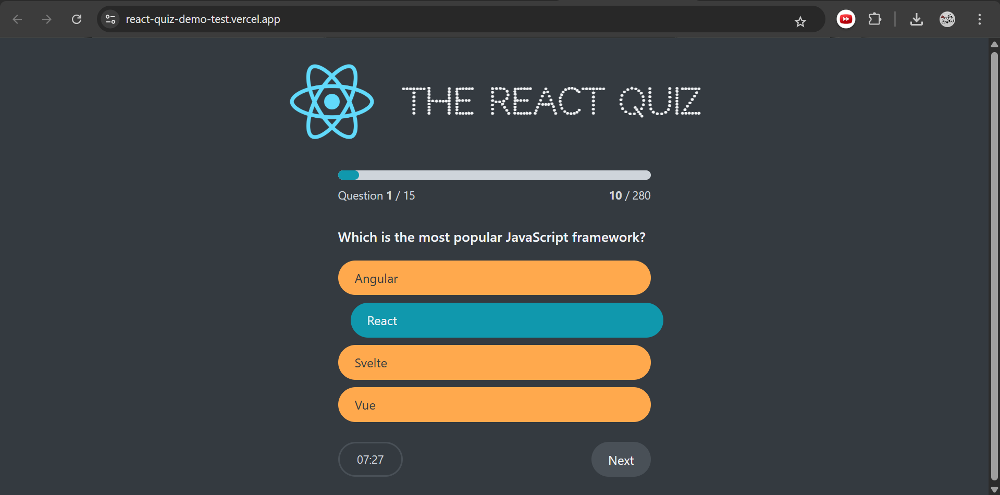
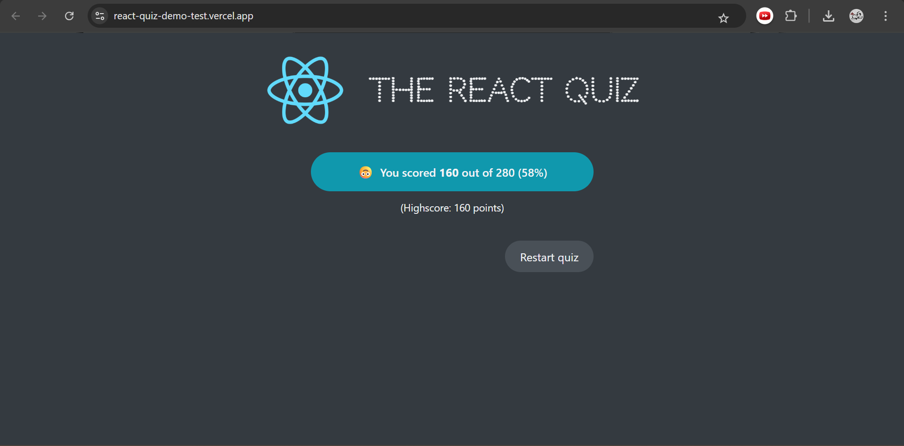

# 🧠 The React Quiz

An interactive quiz application built with React to test your knowledge of core React concepts.
It features a clean UI, real-time progress tracking, scoring system, and smooth user experience.

> Desktop version only.

---

## 🚀 Live Demo

https://react-quiz-demo-test.vercel.app/

---

## 📸 Screenshots

### Start Screen



### Quiz Screen



### Final Score



---

## ✨ Features

* Interactive quiz flow
* Multiple-choice questions
* Progress tracking bar
* Countdown timer per question
* Score calculation system
* High score tracking
* Restart quiz functionality
* Clean and minimal UI

---

## 🛠️ Tech Stack

* React 19 
* Vite 6 
* JavaScript (ES Modules) 
* CSS

---

## ⚙️ Project Setup

This project is built using **Vite + React** with fast refresh and modern tooling. 

The app is mounted on a root element and bootstrapped via `main.jsx`. 

---

## 📁 Project Structure

```bash
src/
├── contexts/
├── data/
├── App.jsx
├── App.css
├── App_no_context.jsx
└── main.jsx
```

---

## 📦 Available Scripts

```bash
npm run dev      # Start development server
npm run build    # Build for production
npm run preview  # Preview production build
npm run lint     # Run ESLint
```

Scripts are defined using Vite tooling. 

---

## 🧹 Code Quality

* ESLint configured with React Hooks rules
* Enforces best practices and clean code structure
* Supports React Fast Refresh


---

## ⚙️ Installation

```bash
git clone https://github.com/your-username/react-quiz.git
cd react-quiz
npm install
npm run dev
```

---

## 📦 Build

```bash
npm run build
```

---

## 👨‍💻 Author

**Mohamed Salama**
